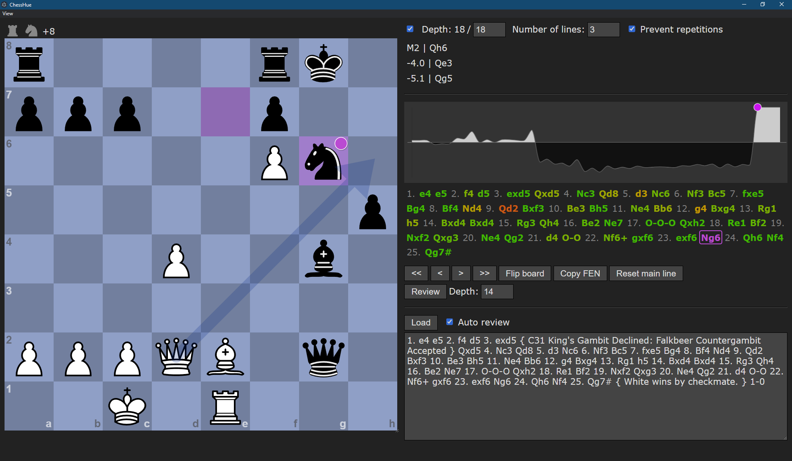

<div align="center">
    <h1>ChessHue</h1>
    
</div>

### GUI for analysis of chess games, with automatic move grading. ###

Created to make post-game analysis as convenient as in the browser, but faster.




Unique features
---------------

* ChessHue registers `chess://` protocol handler,
  which makes it easy to start the application directly from the browser,
  after any game on sites like Chess.com or Lichess, with the PGN automatically filled in.
  See [below](#running-from-the-browser) for details.

* Engines usually evaluate moves that result in repeating a given position the same as the actual winning moves,
  which makes it harder to see what should've been played to convert the advantage.
  In ChessHue there's an option called "Prevent repetitions",
  which fools the engine into thinking that the position has already appeared twice and so the next repetition would be a draw.

* Other applications classify your moves as mistakes, blunders, etc.
  Since these categories are arbitrary and impossible to define unambiguously,
  ChessHue rates moves using a continuous color scale instead.


Requirements
------------

* [Node.js](https://nodejs.org/) (tested with version 20)
* Chess engine: any UCI-compliant engine should theoretically work,
  but only [Stockfish](https://stockfishchess.org/download/) has been tested.
* OS: any modern OS should theoretically work, but only Windows has been tested.


How to use
----------

1. Download your favourite chess engine, rename the executable to `engine.exe`,
   and put it in the root folder of the project.

2. Run `npm install` and `npm run build`, then `npm start` to start ChessHue.


Running from the browser
------------------------

After ChessHue is run once, the next time it can be started using the `chess://` protocol.
You can pass your PGN in the URL, like `chess://e4_e5/`.

To analyse your games in ChessHue right after they end:

1. Install a browser extension that can inject JavaScript code on any website,
   like [Code Injector](https://github.com/Lor-Saba/Code-Injector).

2. Depending on whether you play on Chess.com or Lichess, set up one of the following snippets to inject:

   * Code for Chess.com:

     ```js
     document.addEventListener('keydown', e => {
         if (e.key === 'l' && document.querySelector('.game-review-buttons-component')) {
             const nodes = document.querySelectorAll('.main-line-ply');
             if (nodes.length > 0) {
                 const moves = [...nodes].map(e => e.textContent.trim());
                 const clock = document.querySelector('.clock-bottom');
                 const color = clock.classList.contains('clock-black') ? 'b' : 'w';
                 const url = `chess://${moves.join('_')}/${color}`;
                 window.open(url.replace('#', '%23'), '_blank');
             }
         }
     });
     ```

   * Code for Lichess:

     ```js
     document.addEventListener('keydown', e => {
         if (e.key === 'l' && document.querySelector('.rematch')) {
             const nodes = document.querySelectorAll('l4x kwdb');
             if (nodes.length > 0) {
                 const moves = [...nodes].map(e => e.textContent.trim());
                 const clock = document.querySelector('.rclock-bottom');
                 const color = clock.classList.contains('rclock-black') ? 'b' : 'w';
                 const url = `chess://${moves.join('_')}/${color}`;
                 window.open(url.replace('#', '%23').replace(/½\?/g, ''), '_blank');
             }
         }
     });
     ```

3. After your game, press <kbd>L</kbd> to start ChessHue with the moves imported automatically.

   Note that the code prevents you from accidentally starting the application during the game.
